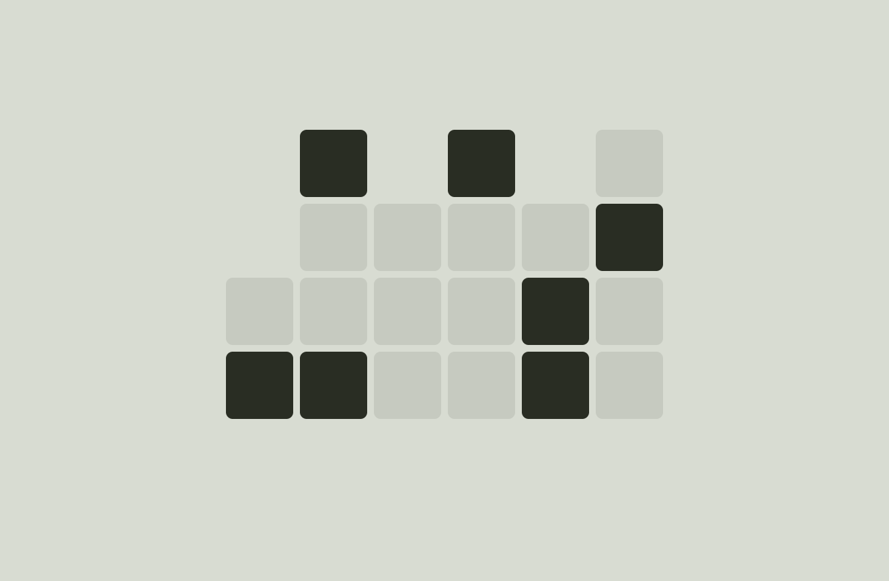
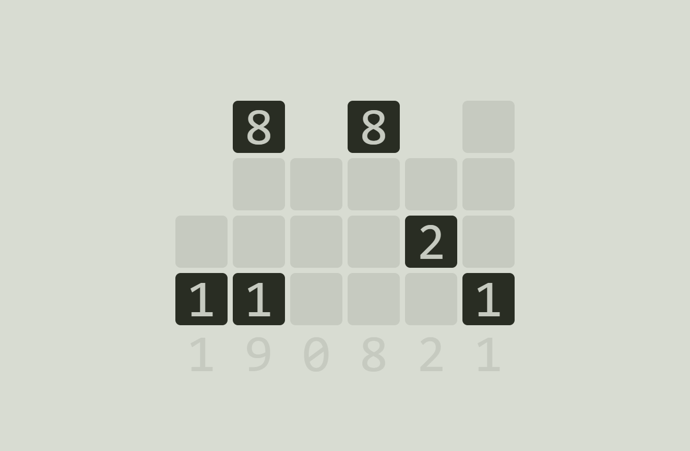

# React-binary-clock

24-hour format binary clock inspired by [wikipedia.org/wiki/Binary_clock](https://en.wikipedia.org/wiki/Binary_clock).

# Live version
[tuhnik.github.io/react-binary-clock](https://tuhnik.github.io/react-binary-clock)

# Usage
``Left click`` - show next hint.  
``Any key`` - switch to next theme.

# Screenshots

